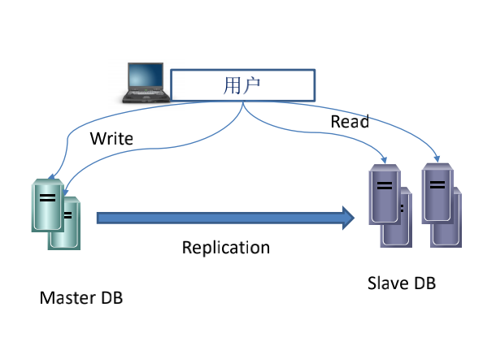
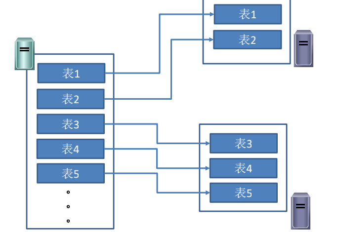
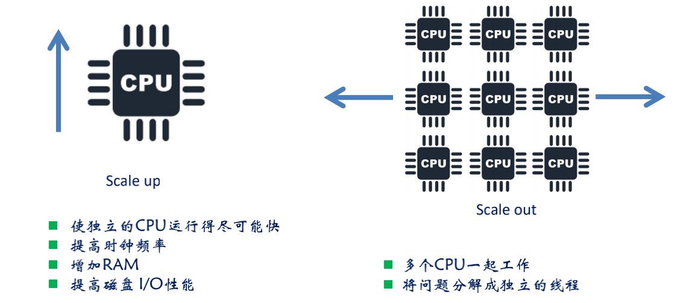
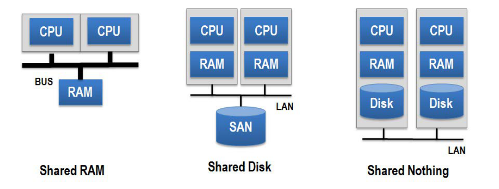
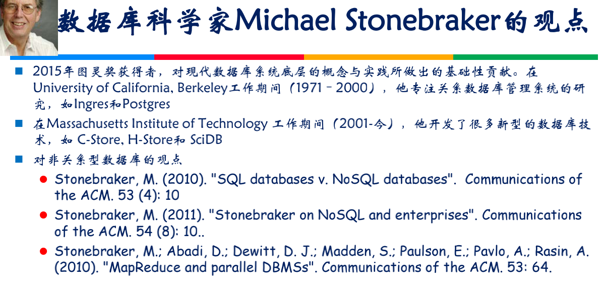
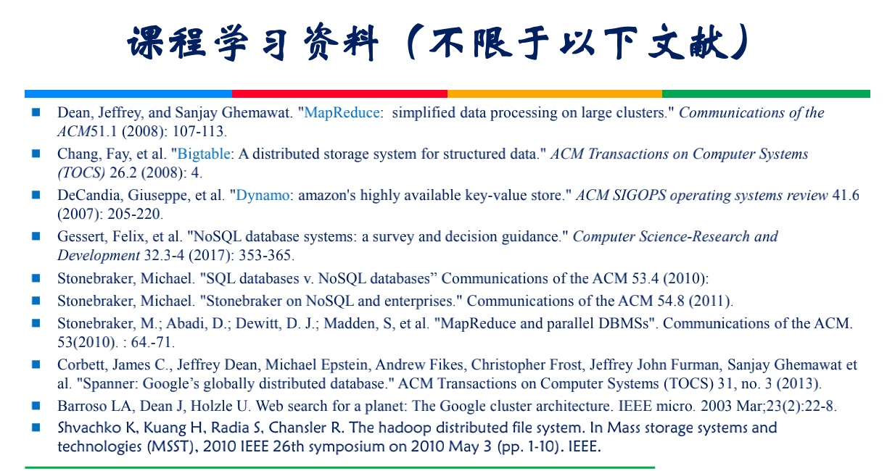
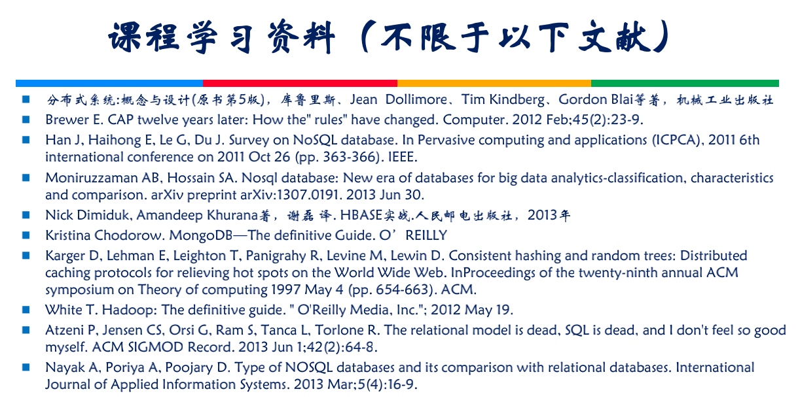

>  非关系型数据库存储技术及其应用

# 概述

## 主要内容

- 非关系型数据库产生的背景
- 非关系型数据库的基本概念
- 非关系型数据库的类型

## 非关系型数据库产生的背景

- 大数据管理及应用需求

  - 大数据特征

    - Volume 大量：数据量大 TB > PB 
    - Velocity 高速 : 数据被创建、移动和处理的速度
    - Variety 多样: 文字、图片、地理位置等
    - Value 价值： 具有价值、但价值密度低

  - 新型应用的数据管理需求

    世界上大部分的数据都是非结构的数据，结构的数据很少

## 数据类型的演化

- Structured
  - Read/Write 
    - Transactional 
    - BI/DW
    - RDBMS
  - Log File 
- Unstructured 
  - Read Mostly
    - Web Crawlers
    - Open Linked Data
  - Documents
    - JSON
    - XML
- Binary
- Graph

## 没有非关系型数据库之前

- Relational
- Analytial(OLAP)

## 有了关心型数据库之后

- Relational
- Analytial(OLAP)
- Key-Value
- Column-Family
- Graph
- Document

## 单节点关系数据库的性能压力

- Single Node RDBMS
  - Scalability
  - Reliability
  - Social Networks
  - Linked Data
  - Agile Schema Free
  - Document-Data
  - OLAP/BI/Data Warehouse
  - Large Data Sets

## 搜索引擎案例的贡献

- 数千亿网页的检索
  - 传统大型关系数据库无法很好地解决海量数据存储和搜索问题
  - 基于互联网的应用： 高并发
- Hadoop Story
  - 创始人 Doung Cutting 和 Mike Cafarella
- 技术发展思路
  - 分布式技术应用
  - HBASE数据库的研发

## 传统数据管理方法存在的问题

- 基于关系数据库

  - 不擅长大量数据的写入操作

    - 解决方法1: 读写分离

      - 出现的问题：更新的数据在两台服务器上，出现数据一致性问题

      

    - 解决方法2：读写分离且写操作分配，

      -  不同表的写操作分配给不同的数据库服务器

    - 解决方法3: 不同的表分配给不同的数据库服务器，

      - 问题： 跨服务实现join非常困难

      

  - 不擅长为有数据更新使需要更新索引，甚至更新表结构

    - 更新时需要加锁。数据访问受限制，高并发应用的性能受影响

  - 不擅长表结构不固定的应用

    - 更新表结构困难

## 计算机系统Scale up 与Scale Out

- Scale up
  - 使独立的CPU运行得尽可能快
  - 提高时钟频率
  - 增加RAM
  - 提高磁盘IO性能
- Scale out
  - 多个CPU一起工作
  - 将问题分解成独立的线程

## 大型机与PC集群

- MainFrame
- Commodity Processors

## 几种计算机提携结构

- Share Nothing 体系结构

  - 集群中的每个节点拥有自己的CPU 内存和磁盘

    

## 几篇重量级的研究论文

- 开辟了非关系型数据库技术，实现以及应用的新篇章
  - Chang, Fay, et al. "Big table : A distributed stroage system for structured data". ACM Transaction on Computer Systems
  - Dean, Jeffrey, and Sanjay Ghemawat, "MapReduce: simplified data processing on large clusters", Communications of the ACM51.1
  - DeCandia, Giuseppe, et al. "Dynamo: amazon's highly available key-value store", ACM SIGOPS operation systems review 41.6 

## 非关系型数据库与NoSQl

- NoSQL 定义： 符合非关系型，分布式、开源和具有水平可扩展能力的下一代数据库
- NoSQl数据库的诞生定位于非结构化性强的数据
  - 对于NoSQL Community, NoSQL称为Not only SQL
  - 数据模型包括
    - Key -value 数据模型
    - Graph数据模型
    - 列簇数据模型 Bigtable
    - 面向文档的数据模型
  - 不提供Join操作
  - 无模式
  - 运行Shared-nothing的商用计算机构成的集群上
  - 具有横向可扩展性

## NoSQL 数据库不是什么？

- NoSQL 不是关于SQL语言，NoSQL不是指不使用SQL查询语言的数据库系统

- NoSQL数据库也提供SQL查询语言

- 既有开源NoSQL数据库产品，也有商用产品

- NoSQL数据库不仅仅针对大数据中量大和高速特征，同样注重多样性

- NoSQL不是云计算；因为良好的可伸缩性，不少NoSQL系统部署在云中

  NoSQL既可以运行在云环境中，也可以运行在自己的数据中心

- NoSQL不是基于RAM和SSD的应用，而是利用RAM和SSD提高性能，NoSQL系统可以运行在标准的硬件上

## NoSQ数据库中数据一致性

- CAP理论： Eric Brewer在2000年提出，是NoSQL数据库的基础
- CAP是分布式环境中设计和部署系统要考虑的三个重要系统需求
  - Consistency 强一致性：更新操作执行成功后所有的用户都应该读到最新的值
  - Availability 可用性:每一个操作总能在一定的时间返回结果，不会发生错误和超时
  - Partition Tolerance 分区容忍性：当网络发生故障时，系统仍能响应客户的请求
- 根据CAP理论，数据共享系统只能满足三个特性中的两个
  - 例如RDBMS满足CA, 分布式数据库满足CP, QQ头像更新满足AP

## 主流NoSQL数据库类型

- Key-value: 数据组织成key-value，使用key访问value
- Column - Family 类型稀疏矩阵，行和列作为key，列族由多个列构成
- graph： 采用图结构存储数据之间的关系
- Document 存储层次数据结构的数据

